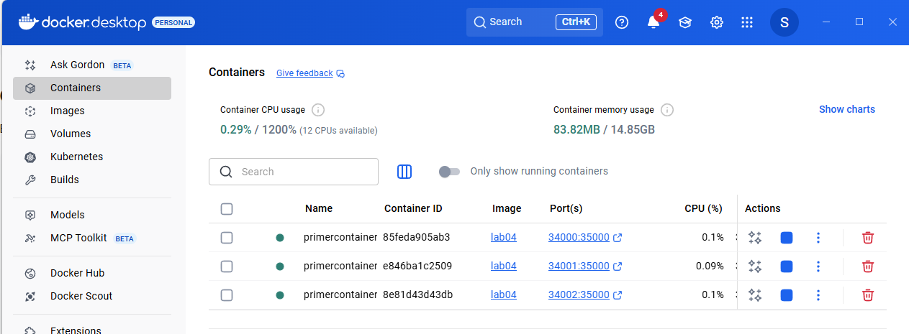
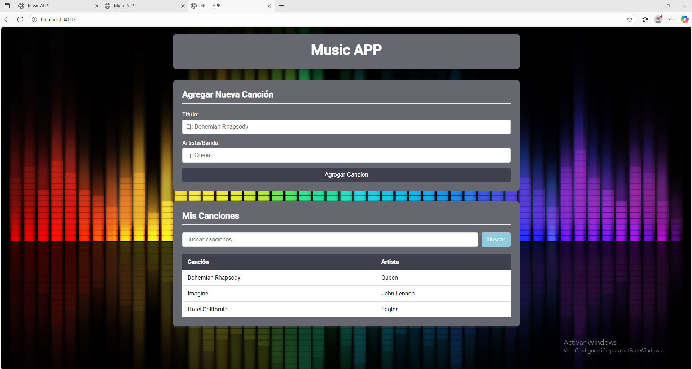
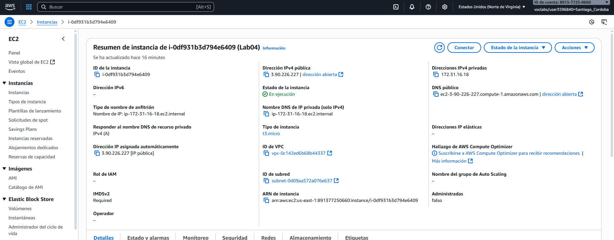
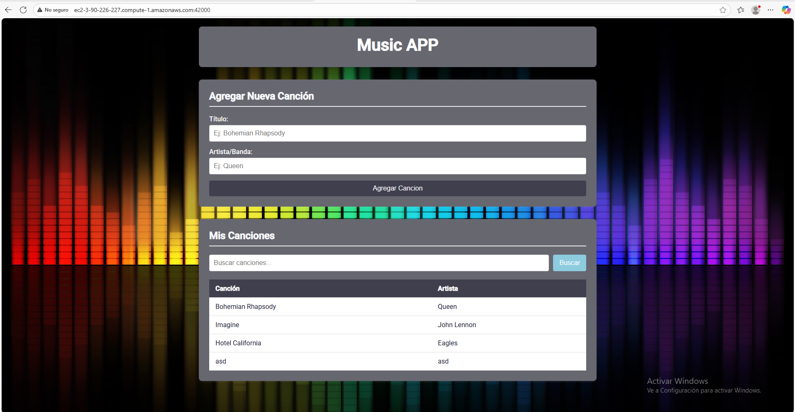
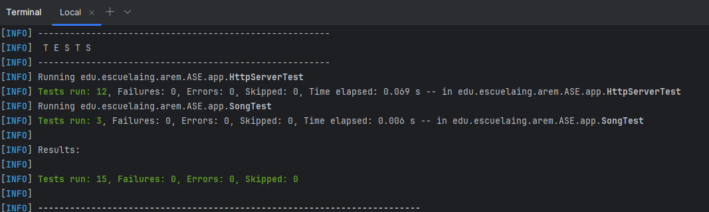

# Lab04  AREP

Para este laboratorio se implemento hilos al MicroSpringBoot y tambien se desplego tanto en Docker en varias instancias 
tambien como se desplego en AWS en un EC2.

Acontinuación se podra ver la evidencia del funcionamiento del despliegue.

### Capturas de Pantalla

En esta imagen vemos la imagen que se creó en Docker.


Lo siguiente es ver los respectivos contenedores/instancias que se crearon.



Ahora probaremos que estas esten en funcionamiento.

- Localhost:34000


- Localhost:34001


- Localhost:34002



Viendo que en Docker ya todo está en funcionamiento lo siguiente que se hara es probar que en AWS este todo en funcionamiento,
para esto lo primero que haremos será mirar que en AWS esté funcionando de manera correcta.





### Video

[Video evidencia del funcionamiento](https://pruebacorreoescuelaingeduco-my.sharepoint.com/:v:/g/personal/santiago_cordoba-d_mail_escuelaing_edu_co/EbREmNldZOxBk0PbkKEnV4sBUDOoOFCTq2Qfo4JdGHsV-Q?e=gh8a4Q&nav=eyJyZWZlcnJhbEluZm8iOnsicmVmZXJyYWxBcHAiOiJTdHJlYW1XZWJBcHAiLCJyZWZlcnJhbFZpZXciOiJTaGFyZURpYWxvZy1MaW5rIiwicmVmZXJyYWxBcHBQbGF0Zm9ybSI6IldlYiIsInJlZmVycmFsTW9kZSI6InZpZXcifX0%3D)

## Running the tests

Se corren los test de las diferentes funciones que se programaron para probar el correcto funcionamiento del proyecto.




### Architecture

Para Frontend se utilizo:

```
- JavaScript
- HTML
- CSS
```

Para backend se utilizo:

```
- Librerias para el manejo de la red (manejo de las peticiones HTTP).
- Librerias para poder realizar las conexiones con los Sockets
```

Directorio:

```
web-framework/
├── src/
│   ├── HttpServer.java
│   ├── Song.java
│   ├── Request.java
│   ├── Response.java
│   ├── Controller.java
│   ├── MicroSpringBoot.java
│   └── Annotations/
│       ├── GetMapping.java
│       ├── RequestParam.java
│       └── RestController.java
├── resources/
│   └── webroot/
│       ├── index.html
│       ├── style.css
│       └── script.js
├── pom.xml
└── README.md
└── DockerFile
```
Arquitectura:

```
Frontend --> Api Rest --> Backend --> Despliegue
```

## Built With

* [Java](https://www.java.com/es) - Lenguaje para el backend
* [Maven](https://maven.apache.org/) - Manejo de Dependencias

## Authors

* **Santiago Córdoba Dueñas**  - [Santiago Córdoba](https://github.com/Santiago-Cordoba)

## Acknowledgments

* Conocimiento de como montar un server Http sin la necesidad de usar frameworks como Spring
* Entendimiento del funcionamiento de los Sockets
* Entendimiento del funcionamiento de los microframeworks
* Entendimiento sobre el funcionamiento de SpringBoot por debajo
* Aprendizaje acerca del uso de Docker
* Aprendizaje acerca del funcionamiento de un EC2 en AWS


